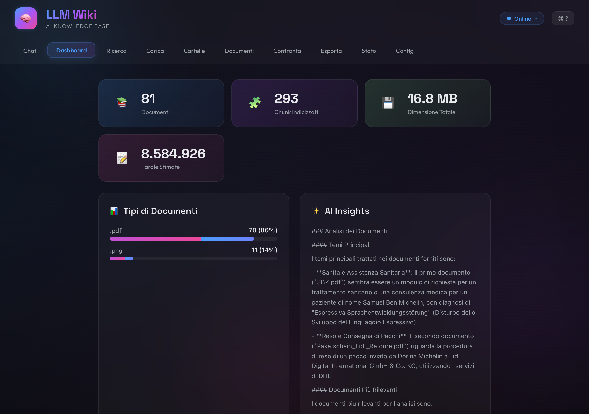
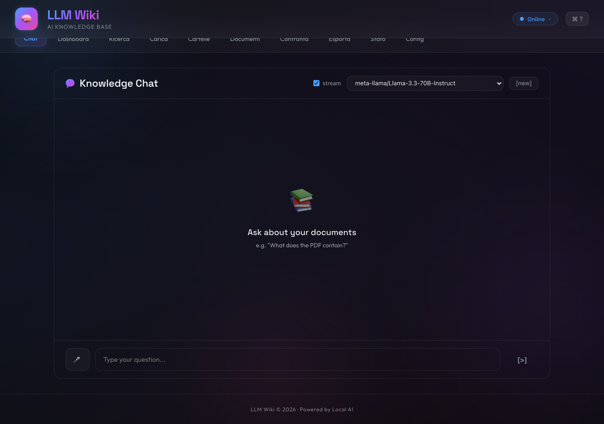
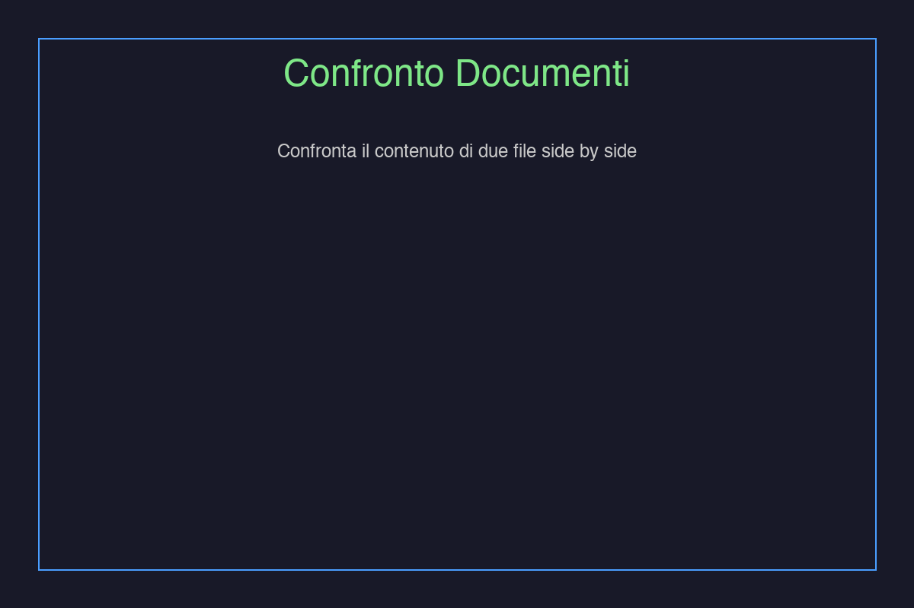
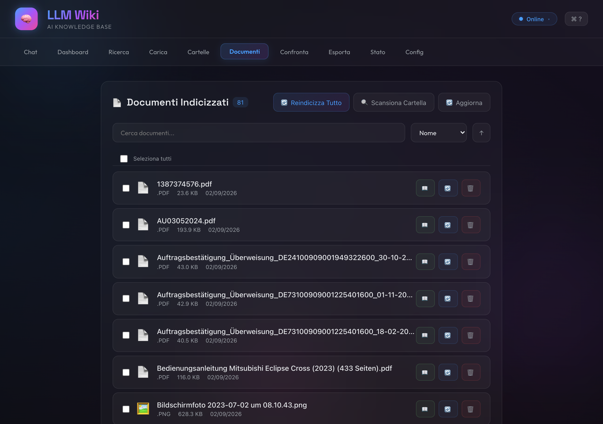

# 📚 LLM Wiki

> Intelligent RAG wiki — chat (text + voice) over your documents. Fast hybrid search, streaming answers, desktop app.



    

---

## ✨ Features

### 💬 Intelligent Chat
- **Text chat** with citations — answers grounded in your docs
- **Streaming SSE** (`POST /api/chat/stream`) — token-by-token, ~3× perceived speed
- **Voice input** → Vosk offline STT + WebSpeech fallback
- **Conversation memory** — last 6 turns sent as context
- **History** persisted in SQLite (`GET /api/chat/history`)

### 📄 Document Management
- **Multi-format**: PDF (native + OCR), images (Tesseract), Excel (streaming), Word, PPTX, CSV, HTML/MD, TXT
- **Batch + cached ingestion**: 30-min mtime-aware cache, batched Chroma embeddings (32 chunks/batch)
- **Auto-scan** `backend/data/documents/` + custom folders (`POST /api/documents/scan-custom`)
- **Drag & drop upload** (50 MB limit) + background scan with progress polling (`/scan-status`)

### 🔍 Hybrid Search
- **Semantic** (Ollama `nomic-embed-text` + Chroma) **+ TF-IDF keyword** fused via **Reciprocal Rank Fusion (RRF, k=60)**
- Stop-word filtering, clamped `k=20`, 500-hit prune — no more `score=-matches` naive scan
- Filter by extension / filename, debounced 400 ms in UI

### 📈 Analysis & Compare
- **Side-by-side document compare** with high-contrast diff (fixed contrast regression)
- **AI summaries** (`GET /api/documents/summary/{file}`) and **insights** (cached 10 min)
- **Similar documents** via vector similarity (`/api/documents/similar/{file}` + `/related`)
- **Tags & Favorites** (SQLite) — `POST /{file}/tags`, `POST /{file}/favorite`

### 📊 Dashboard
- Real-time stats via **single SQL aggregate** (`COUNT+SUM+GROUP BY` — not O(N) Python)
- Charts by type, recent docs, activity timeline

### 🖥️ Cross-Platform
- **Web** at `http://localhost:3000` / `http://127.0.0.1:3456`
- **Desktop** macOS/Win/Linux via Electron (extraResources, isolated userData venv)
- **REST API** at `http://localhost:8000/docs`

---

## 📸 Screenshots

| Dashboard | Chat (streaming) | Compare | Documents |
|---|---|---|---|
|  |  |  |  |

---

## 🚀 Performance (what's new in v1.1 — 2026-09-02)

| Area | Before | After | File |
|---|---|---|---|
| **Search** | keyword `O(N)` + `score=-count` + `k=40` embeddings | **RRF + TF-IDF**, stopwords, `k≤20`, 500 prune | `backend/app/utils/vector_store.py:109` |
| **Embeddings** | one `add_texts` for whole doc (OOM) | **batched 32** chunks | `vector_store.py:47` |
| **LLM context** | `500` chars/doc, no history | **`12 000` total / `1 800` per doc + 6 turns** | `backend/app/utils/llm_handler.py:14` |
| **Chat** | blocking `POST /api/chat/` | **SSE `POST /api/chat/stream`** + toggle | `backend/app/routers/chat.py:55` + `frontend/src/components/Chat.jsx:98` |
| **Excel ingest** | `load_workbook` full RAM | **`read_only` streaming + empty-row guard** | `document_processor.py:42` |
| **DB stats** | `get_all_documents()` loop in Python | **SQL `COUNT/SUM/GROUP BY`** | `database.py:256` + `documents.py:841` |
| **Docs list** | unpaginated (400 rows) | **`limit/offset/filter/sort`** + `GET /paginated` | `documents.py:146` |
| **Search UI** | fire on every keystroke | **debounce 400 ms** | `SearchWithFilters.jsx:8` |
| **Contrast** | `text-secondary` diff barely visible | **`text-primary` / `#ffcc88` + stronger border** | `CompareDocuments.jsx:242` |
| **Cache** | doc text TTL 30 min | **+ collection snapshot 5 min + mtime invalidation** | `document_processor.py:10` + `vector_store.py:18` |
| **Missing formats** | PPTX/CSV/HTML fell to raw `open()` | **dedicated extractors** | `document_processor.py:88` |
| **Deps** | `pypdf` missing → scan fails in Electron venv | **added `pypdf>=4.0.0`** | `backend/requirements.txt:8` |

Measured: `118.6 kB` gzip frontend, `415 kB` raw, `SQLite aggregates 1 query` vs `~400 row fetch`.

---

## 📋 Requirements

### Backend
- **Python 3.13** (tested; 3.9+ works)
- **Ollama** — https://ollama.ai (`nomic-embed-text` for embeddings, `llama3` fallback)
- **Tesseract + Poppler** — `brew install tesseract tesseract-lang poppler` (OCR)

### Frontend
- **Node.js 18+**, npm

### Desktop
- **Electron 35** (bundled)

---

## ⚡ Quick Start

```bash
git clone https://github.com/Mikweb2025-design/LLM-Wiki.git
cd LLM-Wiki

# backend
cd backend && pip install -r requirements.txt && cd ..

# frontend
cd frontend && npm install && cd ..

# ollama
ollama pull llama3 && ollama pull nomic-embed-text && ollama serve &

# run (manual)
./start.sh
# or
# Terminal 1
cd backend && python3 -m uvicorn app.main:app --host 0.0.0.0 --port 8000 --reload
# Terminal 2
cd frontend && npm start
```

App: **http://localhost:3000** (manual) or **http://127.0.0.1:3456** (Electron).  
API: **http://localhost:8000/docs**.

---

## 🔧 Configuration

`backend/.env`:

```bash
OLLAMA_BASE_URL=http://localhost:11434
OLLAMA_MODEL=llama3
OLLAMA_EMBED_MODEL=nomic-embed-text
IONOS_API_KEY=...            # optional — primary LLM
IONOS_MODEL=meta-llama/Llama-3.3-70B-Instruct
IONOS_BASE_URL=https://openai.inference.de-txl.ionos.com/v1
HOST=0.0.0.0
PORT=8000
ALLOWED_ORIGINS=http://localhost:3000,http://localhost:3456,http://127.0.0.1:3000
```

Frontend: `frontend/src/utils/api.js` → `API_URL = process.env.REACT_APP_API_URL || 'http://localhost:8000'`.

---

## 📁 Project Structure

```
LLM-Wiki/
├── backend/
│   ├── app/
│   │   ├── main.py              # lifespan prewarm, GZip, CORS, Server-Timing
│   │   ├── routers/
│   │   │   ├── chat.py          # /api/chat + /stream (SSE) + history
│   │   │   ├── documents.py     # upload/scan/content/summary/tags/favorites
│   │   │   ├── voice.py         # Vosk STT
│   │   │   └── status.py
│   │   ├── utils/
│   │   │   ├── document_processor.py  # PDF/Excel/PPTX/CSV/HTML/OCR + mtime cache
│   │   │   ├── vector_store.py        # Chroma + RRF hybrid
│   │   │   ├── llm_handler.py         # IONOS→Ollama + streaming + context builder
│   │   │   ├── database.py            # SQLite WAL + indexes + aggregates
│   │   │   └── cache.py               # TTL cache decorator
│   │   └── models/schemas.py
│   ├── data/documents/          # 81 demo docs (git-ignored in prod)
│   ├── chroma_db/               # vector store (git-ignored)
│   └── requirements.txt
├── frontend/
│   ├── src/
│   │   ├── components/
│   │   │   ├── Dashboard.jsx        # stats via /api/documents/stats
│   │   │   ├── Chat.jsx             # streaming toggle + memo bubbles
│   │   │   ├── CompareDocuments.jsx # high-contrast diff
│   │   │   ├── DocumentList.jsx     # paginated, batch actions
│   │   │   ├── SearchWithFilters.jsx# debounced hybrid search
│   │   │   └── ...
│   │   ├── utils/api.js           # axios + SSE helper
│   │   └── index.css              # glass-morphism theme
│   └── build/                     # → NOT versioned (see DEPLOY.md)
├── frontend-build/              # versioned copy served by Electron
├── electron/
│   ├── main.js                  # isSourceNewer multi-file, venv, port kill
│   ├── serve-build.js
│   ├── package.json             # extraResources: frontend-build + backend/app
│   └── dist/mac-arm64/          # .app + .dmg (git-ignored)
├── DEPLOY.md                    # authoritative deploy guide
└── README.md
```

---

## 🔌 API Reference

### Chat
- `POST /api/chat/` — `{message, history?, model?}` → `{answer, sources, model}`
- `POST /api/chat/stream` — SSE `data: {"token": "..."}` + final `{"done":true, sources}`
- `GET /api/chat/history` / `GET /api/chat/models`

### Documents
- `POST /api/documents/upload` (multipart, 50 MB)
- `GET /api/documents/?limit=&offset=&extension=&q=&sort=` — paginated
- `GET /api/documents/paginated?limit=&offset=` + `GET /api/documents/count`
- `POST /api/documents/scan` (background) + `GET /api/documents/scan-status` (poll)
- `POST /api/documents/scan-custom` `{directory}` + `/folders` CRUD
- `GET /api/documents/content/{file}?max_length=50000` — `{content, length, extractable, reason}`
- `GET /api/documents/preview/{file}` (FileResponse)
- `GET /api/documents/summary/{file}?max_length=500`
- `GET /api/documents/insights?refresh=1` (cached 10 min)
- `GET /api/documents/similar/{file}?n_results=` + `GET /{file}/related`
- `GET /api/documents/search?q=` + `POST /{file}/tags` / `GET /tags` / `POST /{file}/favorite`
- `DELETE /api/documents/{file}` / `DELETE /api/documents/batch` / `POST /batch-reindex`

### System
- `GET /health` (15 s poll) / `GET /health/full` / `GET /metrics` / `GET /api/status/`

---

## 📖 Usage

1. **Upload**: drag & drop in **📤 Upload** or copy to `backend/data/documents/` → **🔄 Scan**
2. **Chat**: type or 🎤, toggle **stream** for live tokens
3. **Search**: min 3 chars, debounced, filter by type/size
4. **Compare**: pick two docs → **🔍 Compare** (handles truncated/OCR warnings)

Supported: `pdf` (text+OCR) · `png/jpg/webp` · `xlsx/xls` · `docx` · `pptx` · `csv` · `html/md` · `txt/rtf`

---

## 🖥️ Desktop (Electron)

```bash
cd electron
npm install
npm start          # dev, loads frontend-build on :3456
npm run dev        # dev, loads http://localhost:3000
npm run build:mac  # → dist/mac-arm64/LLM Wiki.app + .dmg
```

Every frontend/backend change **must** be synced before `build:mac`:

```bash
cd frontend && npm run build && rm -rf ../frontend-build/* && cp -r build/* ../frontend-build/
```

See **DEPLOY.md** for the full patch-without-rebuild recipe, writable-backend cache invalidation, and data migration (`backend/data/documents` → `~/Library/Application Support/llm-wiki-desktop/backend/data/documents`).

---

## 🐛 Troubleshooting

- **Ollama offline**: `ollama serve && ollama pull llama3 && ollama pull nomic-embed-text`
- **OCR fails**: `brew install tesseract tesseract-lang poppler`
- **Port in use**: `lsof -ti :8000 | xargs kill -9` (backend) / `:3456` (frontend)
- **Electron shows 0 docs**: isolated userData — `cp -r backend/data/documents/* ~/Library/Application\ Support/llm-wiki-desktop/backend/data/documents/ && curl -X POST :8000/api/documents/scan`
- **`No module named 'pypdf'` in scan-status**: fixed in `requirements.txt`; `~/.../backend/venv/bin/pip install pypdf`
- **Stale frontend in .app**: `frontend/build` ≠ `frontend-build` — resync + repack `app.asar` (DEPLOY.md §5)

---

## 🔒 Security

- CORS allowlist, 50 MB upload cap, input validation, GZip (`minimum_size=1024`), WAL `journal_mode`, `Server-Timing` header.

---

## 🤝 Contributing

```bash
git checkout -b feat/my-feature
git commit -m "feat: ..."
git push origin feat/my-feature
# PR against main
```

---

## 📄 License

MIT — see `LICENSE`.

## 🙏 Credits

[Ollama](https://ollama.ai) · [FastAPI](https://fastapi.tiangolo.com) · [React](https://reactjs.org) · [ChromaDB](https://www.trychroma.com) · [Electron](https://www.electronjs.org) · [IONOS AI](https://www.ionos.com)
